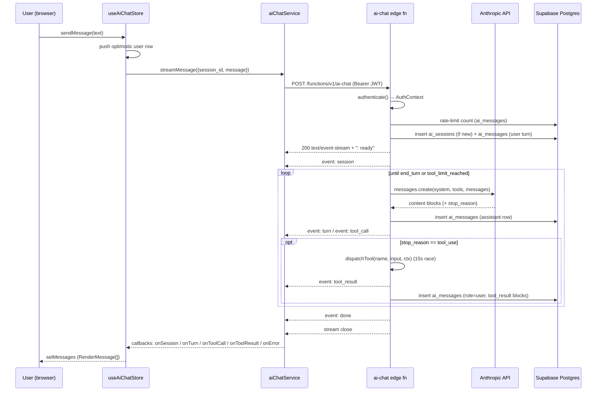

# AI Chat — Architecture & Operations

This document is the maintenance reference for the Cognilion AI chat feature. It explains how the running system fits together and, for every major design choice, why we picked it over the obvious alternatives. If you came here looking for an API reference, read the TypeScript types instead — they are the source of truth for shapes.

## Table of Contents

- [Overview](#overview)
- [Architecture](#architecture)
- [Data Model](#data-model)
- [Attachments](#attachments)
- [Tool Catalog](#tool-catalog)
- [System Prompt](#system-prompt)
- [Context-Window Management](#context-window-management)
- [Frontend Architecture](#frontend-architecture)
- [Security Posture](#security-posture)
- [Deployment](#deployment)
- [Operations & Rate Limiting](#operations--rate-limiting)
- [Troubleshooting](#troubleshooting)
- [Known Limitations](#known-limitations)

---

## Overview

The AI chat is a Croatian-language, read-only question-and-answer assistant embedded in the Cognilion web app. Users open a floating widget, type a question in any language about projects, phases, contracts, subcontractors, invoices, or payments, and receive an answer in Croatian. The answer is composed by Claude (model: `claude-sonnet-4-6`) via the Anthropic Messages API; Claude reaches into Cognilion data through a curated set of 10 tools exposed by a Supabase Edge Function.

The assistant explicitly does NOT mutate any data and does NOT have access to the retail/land-development side of the platform — only construction-side data is reachable. Refusal phrasing for out-of-scope requests is baked into the system prompt. It *can*, since the document-generation work, produce downloadable PDF / Excel / Markdown files on request (see [Document generation](#document-generation)) — that reads data but changes nothing.

The feature shipped over Phases 0–6 between roughly 2026-05-07 (first migration committed: [supabase/migrations/20260507120000_create_ai_chat_tables.sql](../supabase/migrations/20260507120000_create_ai_chat_tables.sql)) and 2026-05-12. It replaces nothing — it is a greenfield feature built on the official `@anthropic-ai/sdk` Deno import.

### Why we built it this way

Four foundational decisions, each made early and worth keeping in mind when reviewing follow-up work:

- **Read-only Q&A scope.** Keeps the v1 surface minimal and defers every write-path safety question (confirmation UX, audit trail, undo semantics, RLS-vs-explicit-check trade-offs for mutations) to a later phase. We can ship something useful in weeks instead of quarters.
- **Per-turn streaming, not per-token.** The SSE stream emits whole content blocks (`turn`, `tool_call`, `tool_result`, `done`) as they happen, not token deltas. The user sees live tool progress without the frontend needing to maintain partial-token state machines or string-merge logic.
- **Croatian output regardless of UI locale.** The user base is Croatian and mixed-locale financial output is a footgun (a comma vs dot decimal separator can change the meaning of a number by 100×). The system prompt enforces output language at the model layer rather than per-string translation.
- **Single-hook + Context state on the frontend.** `AiChatProvider` sits above `<Router>` in [src/App.tsx](../src/App.tsx) because Layout unmounts on every route change. Chat state and the active SSE reader survive navigation.

---

## Architecture

A chat request flows through the system as follows:



### Walking through one request

1. The user types in the panel. `useAiChatStore.sendMessage` ([src/components/AiChat/hooks/useAiChatStore.ts](../src/components/AiChat/hooks/useAiChatStore.ts)) pushes an optimistic `kind: 'user'` row into local state for instant feedback and calls `aiChatService.streamMessage`.

2. `streamMessage` ([src/components/AiChat/services/aiChatService.ts](../src/components/AiChat/services/aiChatService.ts)) reads the current Supabase JWT, POSTs to the edge function with the JWT in `Authorization` and (redundantly) `apikey`, and hands the response body off to a `ReadableStream` reader. The reader splits on `\n\n` (the SSE frame separator), strips `data:` lines, and dispatches one of the typed callbacks per event.

3. The edge function's entry point ([supabase/functions/ai-chat/index.ts](../supabase/functions/ai-chat/index.ts)) authenticates the JWT, branches on whether the body has a `debug_tool` field (Director-only debug branch) or a normal `message` (chat branch), and for chat:
   - calls `handleChat`, which validates and trims input, runs `checkRateLimit`, resolves or creates a session, loads the message history, and inserts the user's message row;
   - then calls `streamChatResponse`, which returns a `Response` whose body is a `TransformStream` fed by a background async worker.

4. The worker flushes `: ready\n\n`, emits the `session` event, then enters `runOrchestrationLoop`. Each iteration:
   - calls `anthropic.messages.create` with the model, system prompt, role-filtered tool list, and the current message array;
   - persists the assistant response row to `ai_messages` BEFORE writing any SSE event;
   - walks the response content blocks and emits `turn` for each `text` block and `tool_call` for each `tool_use` block;
   - if `stop_reason === 'tool_use'`, runs each tool sequentially through `dispatchToolWithTimeout` (15-second race), emits `tool_result` events as handlers return, persists a single `role='user'` row containing all `tool_result` blocks, then loops;
   - otherwise emits `done` and exits.

5. Two hard caps protect the loop: a 90-second per-request timer (surfaces as a mid-stream `error` event with code `request_timeout`) and a 10-iteration tool cap (synthesises a final assistant message with `stop_reason: 'tool_limit_reached'` and a Croatian explanation).

### SSE event taxonomy

All event payloads share `type` as their discriminant. The exact shapes live in [src/types/aiChat.ts](../src/types/aiChat.ts):

```ts
{ type: 'session';     session_id: string }
{ type: 'turn';        role: 'assistant'; text: string }
{ type: 'tool_call';   tool: string; input: unknown; tool_use_id: string }
{ type: 'tool_result'; tool: string; output: unknown; tool_use_id: string; is_error: boolean }
{ type: 'done';        stop_reason: string; usage: { input_tokens: number; output_tokens: number } }
{ type: 'error';       code: string; message: string }
```

In addition to data events, the writer emits SSE comment frames: `: ready` once on stream open, and `: keepalive` every 15 seconds when no real event has been written (otherwise proxies and browsers close idle TCP connections after ~30–60s and slow tool calls would silently kill the stream).

### Persistence order

The orchestration loop persists the durable DB row BEFORE it emits the corresponding wire event. The DB row is the contract; the SSE frame is its projection. Two consequences worth internalising:

- If a persistence write fails, the loop emits an `error` event with code `persistence_error` and never emits the corresponding `turn` / `tool_call` / `tool_result` event. The client never sees a "ghost" event with no underlying row.
- Conversations resume on refresh trivially: `loadSession` reads the rows in `created_at` order and `normalizeFromPersistedRows` produces the same `RenderMessage[]` shape the live stream produces.

### Why SSE over WebSocket or polling

SSE is unidirectional (server → client) and that exactly matches our model — we never push anything to the client outside an active request. WebSocket would add reconnection logic, heartbeat negotiation, and the burden of multiplexing for no benefit, since we have nothing to push on the upstream channel. Polling would lose the live tool-progress UX entirely and force a choice between "wait for the whole answer" (no progress feedback) and "poll for partial state" (a complex synchronisation problem with append-only rows that the SSE design dodges).

---

## Data Model

Three tables back the feature; see [supabase/migrations/20260507120000_create_ai_chat_tables.sql](../supabase/migrations/20260507120000_create_ai_chat_tables.sql) for the original DDL and [supabase/migrations/20260520130000_create_ai_message_attachments.sql](../supabase/migrations/20260520130000_create_ai_message_attachments.sql) for the attachments side-table added in May 2026.

### `ai_sessions`

| Column | Type | Null | Notes |
|---|---|---|---|
| `id` | `uuid` | no | PK, default `gen_random_uuid()` |
| `user_id` | `uuid` | no | FK → `public.users(id)`, ON DELETE CASCADE |
| `title` | `text` | yes | Backfilled from the first 60 chars of the opening user message |
| `created_at` | `timestamptz` | no | default `now()` |
| `updated_at` | `timestamptz` | no | maintained via `public.update_updated_at_column()` trigger |
| `cancel_requested_at` | `timestamptz` | yes | Cancel beacon written by the chat stop button. The orchestration loop polls this and treats any value newer than its own request start as a cancel. See [Cancellation](#cancellation). |
| `context_summary` | `text` | yes | Running natural-language summary of the older part of the conversation. NULL until the thread is long enough to need its first compaction. Written only by the post-turn compaction step. See [Context-Window Management](#context-window-management). |
| `summary_through_message_id` | `uuid` | yes | FK → `ai_messages(id)`, ON DELETE SET NULL. The id of the last message covered by `context_summary` — the summary is only applied to a branch whose ancestor chain contains this id. |

Index: `ai_sessions_user_id_updated_at_idx (user_id, updated_at DESC)` — supports the only list query the frontend issues ("my recent threads, newest first").

> The compaction step UPDATEs `ai_sessions`, so the `update_updated_at_column()` trigger bumps `updated_at` whenever a thread is compacted. This is harmless — the thread *was* just used — but means a compacted thread re-sorts to the top of the recent list on its compaction turn.

### `ai_messages`

| Column | Type | Null | Notes |
|---|---|---|---|
| `id` | `uuid` | no | PK, default `gen_random_uuid()` |
| `session_id` | `uuid` | no | FK → `public.ai_sessions(id)`, ON DELETE CASCADE |
| `role` | `text` | no | CHECK `role IN ('user', 'assistant')` |
| `content` | `jsonb` | no | Anthropic-style content blocks (see below) |
| `model` | `text` | yes | populated on assistant rows only |
| `input_tokens` | `integer` | yes | populated on assistant rows only |
| `output_tokens` | `integer` | yes | populated on assistant rows only |
| `stop_reason` | `text` | yes | populated on assistant rows only |
| `created_at` | `timestamptz` | no | default `now()` — also breaks ties when picking the active branch |
| `parent_id` | `uuid` | yes | self-reference to the previous message in this branch; null on the first message of a session. The conversation is a tree, not a chain — siblings under the same `parent_id` are alternative branches created by edits/regenerates |

Indexes:
- `ai_messages_session_id_created_at_idx (session_id, created_at)` — supports loading every row of a session in one pass and the RLS join to `ai_sessions`.
- `ai_messages_parent_id_idx (parent_id)` — supports the "siblings of this row" query the active-branch derivation runs on every load and branch switch.

### `ai_message_attachments`

| Column | Type | Null | Notes |
|---|---|---|---|
| `id` | `uuid` | no | PK, default `gen_random_uuid()` |
| `message_id` | `uuid` | no | FK → `public.ai_messages(id)`, ON DELETE CASCADE |
| `storage_path` | `text` | no | Object path in the `ai-chat-attachments` bucket. Convention: `{auth_user_id}/{session_id}/{uuid}.{ext}`. The first segment is `auth.users.id` (not `public.users.id`) — that's what the bucket RLS compares against `auth.uid()`. |
| `file_name` | `text` | no | Original filename as supplied by the browser; used for chip labels and download names |
| `file_size` | `integer` | no | Raw byte count; CHECK `file_size > 0` |
| `mime_type` | `text` | no | Whitelisted server-side per kind (see [Attachments](#attachments)) |
| `kind` | `text` | no | CHECK `kind IN ('image','pdf','text')` |
| `extracted_text` | `text` | yes | UTF-8 representation for `kind='text'`; NULL otherwise. CHECK `(kind='text') OR (extracted_text IS NULL)`. Already truncated to ≤50 KB by the client before insert. |
| `created_at` | `timestamptz` | no | default `now()` |

Index: `ai_message_attachments_message_id_idx (message_id)` — every render and lifecycle path looks up attachments by their owning message.

This table is **denormalised replay metadata**, not the authoritative attachment record. The user's `ai_messages.content` JSONB row already contains the fully base64-encoded `image` / `document` blocks plus the user's typed text — that JSONB is what the orchestration loop replays into Anthropic on every follow-up turn (no re-download from storage). The side-table feeds chip/thumbnail rendering in the UI and lets us delete storage objects atomically when a message (or its session) is deleted via the `ON DELETE CASCADE`.

### Ownership and RLS

All three tables have RLS enabled with four owner-scoped policies each (SELECT / INSERT / UPDATE / DELETE). Ownership is established via the canonical scalar subquery `(SELECT u.id FROM public.users u WHERE u.auth_user_id = auth.uid())`. For `ai_messages` the policy joins through the owning `ai_sessions` row; for `ai_message_attachments` it joins through `ai_messages` and then `ai_sessions` (a two-hop EXISTS).

RLS permits owner-scoped UPDATE and DELETE on `ai_messages`, but the application's normal write path is insert-only. Edits and regenerates insert new sibling rows under a shared `parent_id`; nothing is ever rewritten or deleted on a fork. Deletes happen only when the parent session is deleted (the FK cascade clears `ai_messages` for the whole session).

### The row sequence

A typical conversation produces rows in this order:

1. `role='user'` — `content = [{type:'text', text: <user message>}]`
2. `role='assistant'` — `content = [<text and/or tool_use blocks from one Anthropic turn>]`
3. `role='user'` — `content = [<tool_result blocks bundled together>]`
4. …steps 2–3 repeat until the assistant turn returns `stop_reason !== 'tool_use'`
5. `role='assistant'` — `content = [{type:'text', text: <final answer>}]`

Note that step 3 is `role='user'`, not `role='tool'`. This is the Anthropic Messages API contract: tool_result blocks are sent back to the model in the next `user` message. The `CHECK (role IN ('user', 'assistant'))` constraint deliberately mirrors that contract — we store exactly what we exchange with Anthropic and derive the UI shape on read (see [src/components/AiChat/lib/normalizeMessages.ts](../src/components/AiChat/lib/normalizeMessages.ts)).

`model`, `input_tokens`, `output_tokens`, and `stop_reason` are populated only on assistant rows. They are NULL on all user-role rows, including the role='user' tool_result envelopes from step 3.

`ai_sessions.title` starts NULL. On a session's first successful chat round, `backfillTitleIfNew` writes the first 60 trimmed characters of the user's opening message to the column. The title can be edited later via the session menu in the chat header (Preimenuj), which UPDATEs `ai_sessions.title` directly under the existing owner-scoped RLS policy. Deleting a session (Obriši in the same menu) DELETEs the `ai_sessions` row; the FK `ON DELETE CASCADE` from `ai_messages` removes every row in the conversation in the same statement.

### Branching (edit / regenerate)

The chat UI lets the user fork prior turns:

- **Edit a user message** — hover the user bubble → pencil → edit text → Spremi. The backend looks up the target row's `parent_id` and inserts the new user message as a **sibling** under that parent. Nothing is deleted. The orchestration loop then streams a new assistant response under the new user row, creating a fresh branch in the tree.
- **Regenerate the last assistant response** — hover the last assistant bubble → refresh. Mechanically identical to editing the most recent user message with its own text: a new user-row sibling is created, then a fresh assistant response under it.
- **Branch switcher** — every user message in the active view that has siblings shows a `‹ N/M ›` control beneath the bubble. Clicking the arrows asks the store to walk into a sibling's subtree (picking its most-recent leaf) and re-renders the conversation along that path.

The active branch is computed implicitly: the row with the largest `created_at` in the session is the active leaf, and walking `parent_id` back to root yields the active path. This means a freshly streamed branch is always the one shown on reload — there is no per-session "selected branch" pointer, by design. Branch switches via the arrows are client-side only; they do not persist across `loadSession` calls.

Every persisted row carries an explicit `parent_id`. New user rows chain off the active leaf (or off `target.parent_id` for an edit). The assistant row from each Anthropic turn points at the row it answers (the user message or a prior tool_result). Tool-result rows (role='user' with `tool_result` blocks only) point at the assistant row that emitted the `tool_use` blocks they answer. The next assistant turn in a tool loop points at the tool_result row.

The client passes `parent_message_id` (its current active leaf id) on every non-edit send. For edits it passes `edit_message_id` instead and the server derives the sibling's parent from the target. Edits are rejected (`invalid_request`) when there is no `session_id` yet (brand-new conversation) or when the target is not a user-role row; edits go through the same rate-limit gate as fresh sends.

---

## Attachments

Users can paperclip or drag-drop files onto a message. The model sees them as multimodal content blocks: `image` (PNG/JPEG/WEBP) and `document` (PDF) blocks via Anthropic's vision/document API, plus inline text blocks for TXT/CSV/Excel.

### Upload flow

1. The user picks or drops files in `AiChatInput`; the store records them in `pendingAttachments` with `status='pending'`.
2. On send, the store kicks off `uploadAiAttachment` per pending entry. For new conversations the store generates a `proposed_session_id` UUID upfront so the storage path can use the final `{auth_user_id}/{session_id}/...` shape before the server creates the session row.
3. After all uploads succeed, the store calls `streamMessage` with the attachment metadata (`storage_path`, `file_name`, `file_size`, `mime_type`, `kind`, `extracted_text`).
4. The edge function re-validates everything server-side, downloads bytes from storage (service-role; the path-prefix check is the security control), base64-encodes them into Anthropic `image`/`document` blocks, and persists the full multimodal array as the user row's `content` JSONB. It then bulk-inserts `ai_message_attachments` rows; if that fails it rolls back the user row and best-effort-deletes the storage objects.

### Storage

A private Supabase Storage bucket `ai-chat-attachments` is provisioned by [supabase/migrations/20260520130100_create_ai_chat_attachments_bucket.sql](../supabase/migrations/20260520130100_create_ai_chat_attachments_bucket.sql). Objects are stored at `{auth_user_id}/{session_id}/{uuid}.{ext}` and accessible only to the owner via four `storage.objects` RLS policies that scope SELECT/INSERT/UPDATE/DELETE to `(storage.foldername(name))[1] = auth.uid()::text`. The bucket is `public=false`; rendered images and download chips use `createSignedUrl` with a 3600s TTL (matching `documentService.ts` / `tasksService.ts`). If a chat panel stays open past 1h the next image click triggers an `onError` refetch — pragmatic mitigation, not a hard fix.

**Why `auth.users.id`, not `public.users.id`.** Storage RLS uses `auth.uid()` directly. The path-prefix check in [supabase/functions/ai-chat/index.ts](../supabase/functions/ai-chat/index.ts) (`storage_path.startsWith(authUserId + '/')`) must use the same value, hence the `authUserId` field on `AuthContext`. Mixing the two would either let users into each other's prefixes (the service-role download bypasses RLS — only the prefix check stops cross-user reads) or break valid uploads.

### Multimodal content blocks

The user row's `content` JSONB is the authoritative replay format. A row sent with one image and a typed question persists as something like:

```jsonc
[
  { "type": "image", "source": { "type": "base64", "media_type": "image/png", "data": "<base64>" } },
  { "type": "text", "text": "Što je na ovoj slici?" }
]
```

For text-kind attachments the block is a plain text block prefixed with `[Priložena datoteka: <name>]\n\n<extracted text>` — no separate `document` block. `runOrchestrationLoop` finds the text block by `type` (it's always last in our convention but the lookup is type-keyed so a different ordering wouldn't silently clobber image/document blocks) when prepending the `[Kontekst: ...]` line.

On history reload, `loadSession` runs a second batched query against `ai_message_attachments` (`message_id IN (...)`) to populate render-side chips and thumbnails. The query is **fail-open**: a side-table hiccup degrades UI (no chips) but does not block history load, because the model still has full fidelity via the JSONB.

### Limits

| Kind | Raw size cap | Notes |
|---|---|---|
| Image | 5 MB | `image/png`, `image/jpeg`, `image/webp`; extensions `.png` / `.jpg` / `.jpeg` / `.webp` |
| PDF | 10 MB | `application/pdf`; extension `.pdf` |
| Text | 2 MB raw | `text/plain`, `text/csv`, `application/vnd.openxmlformats-officedocument.spreadsheetml.sheet`, `application/vnd.ms-excel`; extensions `.txt` / `.csv` / `.xls` / `.xlsx` |
| Extracted text | 50 KB | Hard cap after parsing. Anything beyond is truncated with `\n\n...[truncated]`. Excel parses **first sheet only** to CSV via `@e965/xlsx`; the system prompt instructs the model to disclaim multi-sheet workbooks. |

Hard cap of **4 attachments per message**, enforced both client- and server-side. Both the MIME type AND the filename extension must pass the per-kind whitelist (defense in depth against MIME spoofing).

### Edit + attachments interaction

Editing a message creates a new sibling branch under the same `parent_id`. By design **attachments are dropped on edit**: the new sibling has none. The original attachments remain linked to the original sibling, which is still reachable via the `‹ N/M ›` branch switcher. The edge function explicitly rejects `attachments` combined with `edit_message_id` (`edit_with_attachments_unsupported`) so a misbehaving client can't half-attach.

### Cleanup and orphans

Three places can produce orphan storage objects (uploaded bytes without a DB row):

- **User cancels mid-upload** — `removePendingAttachment` cleans up the object if the upload had already succeeded.
- **Send fails after uploads succeeded** — `sendMessage`'s catch block iterates the in-call uploaded paths and best-effort-deletes them.
- **Server-side attachment insert fails after user row succeeds** — `handleChat` deletes the user row and best-effort-removes the storage objects before returning 500.

These cover the common cases; a hard crash mid-flight can still leak. No background cleanup job exists yet — orphan accumulation is acceptable for v1 and documented in [Known Limitations](#known-limitations).

---

## Tool Catalog

12 tools, defined in [supabase/functions/_shared/tools.ts](../supabase/functions/_shared/tools.ts) and implemented in [supabase/functions/_shared/tool-handlers.ts](../supabase/functions/_shared/tool-handlers.ts) (the help-search tool lives in `help-search.ts`). For each tool, JSON Schema and exact input/output shapes live in those files — do not duplicate them here.

### Role gating

| Tool | Director | Accounting | Sales | Supervision | Investment |
|---|---|---|---|---|---|
| `search_projects` | ✓ | ✓ | ✓ | ✓ | ✓ |
| `get_project_details` | ✓ | ✓ | ✓ | ✓ | ✓ |
| `list_project_phases` | ✓ | ✓ | ✓ | ✓ | ✓ |
| `search_subcontractors` | ✓ | ✓ | ✓ | ✓ | ✓ |
| `list_contracts` | ✓ | ✓ | ✓ | ✓ | ✓ |
| `get_subcontractor_payment_status` | ✓ | ✓ |   |   |   |
| `list_unpaid_invoices` | ✓ | ✓ |   | ✓ |   |
| `list_payments_for_subcontractor` | ✓ | ✓ |   |   |   |
| `get_invoice_summary` | ✓ | ✓ |   |   |   |
| `get_project_financial_summary` | ✓ | ✓ |   |   |   |
| `create_document` | ✓ | ✓ | ✓ | ✓ | ✓ |

`search_help` (omitted from the table) is also available to every role.

Three role-buckets in code: `ALL_ROLES` (every role), `FINANCE_ROLES` (Director + Accounting), `FINANCE_PLUS_SUPERVISION` (the finance pair plus Supervision, the latter scoped to assigned projects by handler logic).

### What each tool returns

- **`search_projects`** — substring search on `projects.name`; returns `{id, name, location, status}`. Construction projects only; retail projects are a separate table and not searched.
- **`get_project_details`** — full `projects` row plus exact counts of phases, contracts, and milestones for the project. The project lookup runs first so that RLS-hidden projects don't leak counts through the (USING(true)) related tables.
- **`list_project_phases`** — phases for a given project, ordered by `phase_number`. Deliberately omits `budget_used` (see landmines below).
- **`search_subcontractors`** — substring search on `subcontractors.name`; returns `{id, name, contact, active_contracts_count}`.
- **`list_contracts`** — contracts filterable by project / phase / subcontractor / status, with joined `subcontractor`, `phase`, `project` summaries. For Supervision users, filters to assigned projects only.
- **`get_subcontractor_payment_status`** — rollup of contracts + invoices for a single subcontractor: contracted total, invoiced total, paid total, outstanding balance.
- **`list_unpaid_invoices`** — invoices with status `UNPAID` or `PARTIALLY_PAID`, optionally filtered by subcontractor or project. For Supervision users, RLS scopes results.
- **`list_payments_for_subcontractor`** — individual payment records (date, amount, method, cesija flag, linked invoice number) for one subcontractor; joins through `accounting_invoices.supplier_id`.
- **`get_invoice_summary`** — aggregate counts and unpaid sums across `accounting_invoices`, backed by the `get_invoice_statistics` SECURITY DEFINER RPC.
- **`get_project_financial_summary`** — full financial rollup for a single project: project budget, contract sums and realised spend, invoice totals via both direct `project_id` and transitive `contract_id` paths (deduped), plus a derived summary block with `committed` / `spent` / `remaining_to_*` / `over_budget` fields.
- **`create_document`** — produces a downloadable PDF, Excel (`.xlsx`), or Markdown file for the user. Unlike every other tool it reads no data: the model authors the whole document from data it already gathered, and the handler only *validates* the spec. See [Document generation](#document-generation).

### Data-model landmines the tools navigate around

Each landmine below has been observed in the wild and is encoded in handler logic or tool descriptions. Future maintainers, do not "tidy" them away.

- **`accounting_invoices.supplier_id` FKs to `subcontractors`, not to a (non-existent) "suppliers" table.** There has never been a separate suppliers table. Affects: `get_subcontractor_payment_status`, `list_unpaid_invoices`, `list_payments_for_subcontractor`. The tools' JSON Schema descriptions name this explicitly so the model doesn't try to filter on a phantom column.
- **`project_phases` ≠ `project_milestones`.** Two different tables for two different concepts; "phase X of project Y" always means `project_phases`. Affects: `get_project_details` (counts both separately), `list_project_phases` (only phases).
- **`project_phases.budget_used` is NOT trigger-maintained and is unreliable.** `list_project_phases` deliberately omits it from the SELECT list, and the tool description points the model at `get_project_financial_summary` (which uses `contracts.budget_realized`, which IS trigger-maintained) for accurate spend numbers.
- **Status casing varies across tables.** `projects.status` is Title Case; `contracts.status` is lowercase; `accounting_invoices.status` is `SHOUTING_SNAKE_CASE`. Tools surface raw values and the system prompt tells the model not to normalise.
- **`accounting_companies` is the canonical companies table.** A vestigial `companies` table exists but is not used by AI chat tools or current app code.
- **`get_project_financial_summary` builds a PostgREST `.or()` filter from caller input.** It is the only handler that does. To prevent filter-syntax injection, it validates `input.project_id` against `UUID_RE` before interpolating it into the `.or()` string. `contractIds` interpolated alongside come from a prior DB query (DB-issued UUIDs) and are trusted.
- **Cesija (`is_cesija: true` on `accounting_payments`).** A cesija is a Croatian debt-assignment pattern: company A pays company B's invoice. Not an error. The system prompt tells the model to surface the fact when cesija payments appear in payment history.
- **`get_invoice_summary` is backed by a SECURITY DEFINER RPC** (`get_invoice_statistics`) that bypasses RLS and returns global totals. Access is gated solely by the tool's `requiredRoles = [Director, Accounting]` filter in [supabase/functions/_shared/tools.ts](../supabase/functions/_shared/tools.ts). If this tool were ever exposed to other roles without changing the access model, every role would see global invoice totals.

### Why we curate tools instead of giving Claude SQL

Curation buys us four things at once: it enforces role-gating at the function layer (cleaner and more auditable than relying on RLS to be set up correctly for every read path); it pre-validates inputs (UUID format checks, limit clamps, ilike-wildcard escaping); it surfaces only the fields we want the model to see (notably hiding `budget_used`); and it bounds the cost surface (the model cannot author an accidentally-expensive query against a 50M-row table). The trade-off is that adding new query shapes requires writing handler code, but in practice the curated tool set covers the vast majority of useful questions.

### Document generation

`create_document` lets the assistant hand the user a downloadable file — a PDF or Markdown write-up, or an Excel (`.xlsx`) data export. It is deliberately **not** a server-side document service. The design:

- **The model authors the document.** The tool input *is* the document: a `title`, a `format` (`pdf` | `xlsx` | `markdown`), and either a `markdown` body (for `pdf`/`markdown`) or a `sheets` array (for `xlsx`). The model writes that content from data it already fetched with the other tools — `create_document` itself reads nothing.
- **The handler only validates.** [`handleCreateDocument`](../supabase/functions/_shared/tool-handlers.ts) checks format/field presence and enforces size caps (markdown ≤ 50 000 chars; ≤ 10 sheets, ≤ 50 columns, ≤ 5 000 rows each; ≤ 60 KB total serialized spec). It touches no database or storage. Its `tool_result` is a short confirmation string only — **not** the spec echoed back — so the spec is not double-counted in context-window replay.
- **The file is generated client-side, on download.** The document spec rides in the persisted `tool_use` block inside `ai_messages.content`. The frontend reconstructs it ([`parseDocumentSpec`](../src/components/AiChat/lib/normalizeMessages.ts) → a `document` RenderMessage) and renders a download card ([`DocumentCard`](../src/components/AiChat/components/DocumentCard.tsx)). Clicking Download runs [`documentGenerator.ts`](../src/components/AiChat/lib/documentGenerator.ts), which builds the file in the browser — jsPDF (with the shared NotoSans loader, [`pdfFont.ts`](../src/utils/pdfFont.ts)) for PDF, `@e965/xlsx` for Excel, a plain blob for Markdown.

Consequences of this design: **no storage bucket and no new table** — the spec lives in the message row, so a document is re-downloadable from history after a reload. PDF rendering covers a minimal Markdown subset (headings, paragraphs, **bold**, bullet/numbered lists); tables render best-effort. PDF generation fetches NotoSans from `fonts.gstatic.com` on download and falls back to Helvetica offline (Croatian glyphs degrade), matching the Reports module's behavior.

---

## System Prompt

The Croatian-language system prompt is built per-request by `buildSystemPrompt` in [supabase/functions/_shared/prompts.ts](../supabase/functions/_shared/prompts.ts). It is intentionally pure / deterministic given the `AuthContext` — no clock, no environment lookups, no project-list interpolation. The full text lives in that file; the structure is:

- **Identity & scope** — what the assistant is, plain-language framing of its read-only role.
- **User context** — interpolated `email` and `role`; for Supervision users, an extra sentence noting that data access is scoped by RLS.
- **Tools** — a single short paragraph telling the model to use the tools advertised in the Anthropic `tools` array for concrete data; tool names are deliberately not repeated here to prevent drift.
- **Refusal patterns** — the two canned Croatian phrases for out-of-scope requests (mutation/file work) and for role-insufficient data requests. Both are short, with no apologising or capability enumeration.
- **Data-model landmines** — the four landmines from the previous section, restated for the model: `supplier_id` → subcontractors, phases ≠ milestones, `budget_used` is stale, status casing varies. The model must read these to produce correct answers; they are not optional decoration.
- **Domain flags** — instructions for `is_cesija` (mention it when present) and `has_contract: false` (note that `contract_amount` may understate informal arrangements).
- **Formatting rules** — Croatian number, currency, and date formats (`1.234,56`, `1.234,56 EUR`, `dd.MM.yyyy.`). The model formats raw numbers and ISO dates returned by the tools at output time.
- **Tone & behaviour** — answer in Croatian regardless of input language; match response length to question length; no preamble; flag missing or ambiguous data explicitly; no business-judgement commentary.

### Why the prompt lives in code, not a DB row

The prompt iterates rapidly during development and each iteration ships in the same commit as any related handler / schema / tool-description change. Storing it in a row would mean every prompt change is a schema-config change, with no commit-level versioning, no review history, and no atomic "the code and prompt match" guarantee. The prompt is logically part of the function, not part of the data.

---

## Context-Window Management

Every chat turn replays the full ancestor chain (root → leaf) to Anthropic — that is how the assistant keeps conversation context (see [The row sequence](#the-row-sequence)). Left unbounded, a thread a user keeps open indefinitely would eventually produce a chain that exceeds the model's ~200K-token context window, at which point *every* call on that thread fails. Three mechanisms keep the replayed history bounded. They live in [supabase/functions/_shared/context-window.ts](../supabase/functions/_shared/context-window.ts) and are wired into the edge function's history-load and orchestration paths.

### 1. Running summary (compaction)

When a thread's un-summarised history grows past `COMPACT_TRIGGER_TOKENS` (60K estimated tokens), the older turns are folded into a natural-language summary:

- **When** — after a turn completes cleanly, `maybeCompactSession` runs in `streamChatResponse`, *after* the `done` event. It is off the user's critical path: the answer is already delivered; compaction just prepares the next turn. It is best-effort and never throws — a failure simply means the next turn replays a bit more history and retries.
- **What** — the chain is grouped into *turns* (a real user message plus every assistant / tool_use / tool_result row until the next real user message). The most recent turns within `KEEP_TOKEN_BUDGET` (20K) are kept verbatim; everything older is summarised. A summarisation call to Anthropic (model `AI_CHAT_SUMMARY_MODEL`, defaulting to the main chat model) produces the summary; it is incremental — an existing summary is passed back in and folded together with the newly-aged turns into one updated summary.
- **Where stored** — `ai_sessions.context_summary` plus `ai_sessions.summary_through_message_id`, the id of the last message the summary covers.
- **On send** — `selectKeptChain` applies the stored summary: it replays `[summary] + [turns after the boundary]` instead of the whole chain. The summary text is folded into the oldest surviving message as plain context (in-memory only — persisted `ai_messages` rows are never rewritten, mirroring the route-context trick).

**Branch safety.** The conversation is a tree. A summary computed for one branch must not silently apply to a sibling. The summary is therefore keyed to `summary_through_message_id`: it is applied only if that id appears in the current branch's ancestor chain. If the user edited/regenerated *before* the boundary, the id is absent and the summary is ignored — the next compaction rebuilds one for the new branch. The `ON DELETE SET NULL` FK means deleting the boundary message also cleanly invalidates the summary.

**Turn-atomic trimming.** All trimming cuts on turn boundaries, never inside a turn. This guarantees a `tool_use` block is never separated from its matching `tool_result` — a split Anthropic rejects outright.

### 2. Attachment stripping

Base64 image/PDF bytes are by far the largest per-message cost and are replayed verbatim on every turn. `stripOldAttachments` replaces `image` / `document` blocks with a short Croatian text placeholder on every history message except the most recent `ATTACHMENT_KEEP_RECENT` (6). The just-sent user turn is appended *after* stripping, so the current message's attachments are always intact; an uploaded file stays visible to the model for roughly three follow-up turns.

### 3. Hard ceiling (backstop)

`enforceHardCeiling` drops whole oldest turns if the assembled history still exceeds `HARD_CEILING_TOKENS` (130K) after the summary is applied. With compaction running this essentially never fires; it exists for the first turn on a thread that was already long before this feature shipped.

### Prompt caching

Independently of trimming, the request is structured for [Anthropic prompt caching](https://docs.anthropic.com/en/docs/build-with-claude/prompt-caching) so the stable, repeated prefix is billed at the cache-read rate (~0.1×) instead of full rate:

- The **system prompt** and **tool schemas** are byte-identical on every turn — each carries a `cache_control: ephemeral` breakpoint.
- `applyMessageCacheBreakpoint` slides a third breakpoint onto the last block of the last message before every Anthropic call, so the whole conversation-so-far becomes a cacheable prefix for the next call (and for the next iteration of the tool loop).

Caching does not shrink the context window — it only cuts cost and latency — so it complements, rather than replaces, the three trimming mechanisms above.

### Tunables

All thresholds are module constants in [context-window.ts](../supabase/functions/_shared/context-window.ts) (`COMPACT_TRIGGER_TOKENS`, `KEEP_TOKEN_BUDGET`, `HARD_CEILING_TOKENS`, `ATTACHMENT_KEEP_RECENT`); token figures are deliberately rough estimates (chars / 4, with flat costs for image/document blocks) that drive threshold decisions only. The summarisation model is the `AI_CHAT_SUMMARY_MODEL` env var.

---

## Frontend Architecture

### File layout

```
src/components/AiChat/
├── AiChatHeader.tsx
├── AiChatInput.tsx
├── AiChatMessage.tsx
├── AiChatMessageList.tsx
├── AiChatPanel.tsx
├── AiChatProvider.tsx     ← Context + provider
├── AiChatTrigger.tsx
├── AiChatWidget.tsx       ← mount point; route-based hiding
├── hooks/
│   └── useAiChatStore.ts  ← single internal hook
├── lib/
│   ├── labels.ts          ← Croatian tool / error labels
│   └── normalizeMessages.ts ← RenderMessage[] producer
└── services/
    └── aiChatService.ts   ← SSE client + REST helpers
```

Plus [src/types/aiChat.ts](../src/types/aiChat.ts) for the event taxonomy and the `AiChatHttpError` class.

### State model

`AiChatProvider` ([src/components/AiChat/AiChatProvider.tsx](../src/components/AiChat/AiChatProvider.tsx)) is mounted in [src/App.tsx](../src/App.tsx) wrapping `<AppContent />`, which means it sits ABOVE `<Router>` in the tree. This is deliberate: the app's routing uses Pattern B (each route renders its own `<ProtectedRoute><Layout>...</Layout></ProtectedRoute>` tuple), so `Layout` unmounts on every route change. Anything stored inside a Layout-mounted component would die on navigation; the chat panel, message history, and active stream reader would all reset.

`useAiChatStore` ([src/components/AiChat/hooks/useAiChatStore.ts](../src/components/AiChat/hooks/useAiChatStore.ts)) is called exactly once, by the provider. It is NOT exported for use by consumers. Consumers call `useAiChat()` from `AiChatProvider.tsx` to get the Context value. Calling `useAiChatStore` directly anywhere else would create a second copy of the entire chat state.

### RenderMessage normalisation

Components never see DB rows or raw SSE events. Both shapes flow through `normalizeMessages.ts`:

- `normalizeFromPersistedRows(rows)` is called by `selectSession` after `loadSession`.
- `applyEventToMessages(prev, event, genId)` is called inside each callback (onTurn / onToolCall / onToolResult / onError) and folds the event into the current `RenderMessage[]`.

The shared `RenderMessage` discriminated union has four kinds: `user`, `assistant`, `tool` (with status: pending → completed/error), and `error`. The list components iterate this single shape regardless of source.

### SSE consumption

`streamMessage` in [src/components/AiChat/services/aiChatService.ts](../src/components/AiChat/services/aiChatService.ts) uses `fetch` + `ReadableStream` rather than `EventSource`. EventSource cannot use POST and cannot send custom headers, both of which we need (POST for the request body, `Authorization: Bearer <JWT>` for auth).

The reader splits on `\n\n` (the SSE frame separator), strips `:`-prefix comment frames, concatenates `data:` lines within a frame, parses the JSON payload, and dispatches by the payload's `type` field. The `event:` line is intentionally ignored — the JSON's `type` is the source of truth, the `event:` line is for compatibility with stricter SSE consumers.

### Optimistic user write

The user's input is pushed into local state immediately, before any network call. This gives instant feedback. The trade-off, documented in a comment at [src/components/AiChat/hooks/useAiChatStore.ts](../src/components/AiChat/hooks/useAiChatStore.ts) (around line 165): if the network drops mid-stream BEFORE the backend persists the user row, the optimistic row remains locally but is missing server-side. On the next `loadSession` it silently disappears. **Do not "fix" this by double-writing the user row from the client** — that produces a worse bug (duplicate rows that may or may not be visible depending on which write succeeded).

### Route-based hiding

`AiChatWidget` ([src/components/AiChat/AiChatWidget.tsx](../src/components/AiChat/AiChatWidget.tsx)) returns `null` in three cases:
- `loading` (auth still resolving) — avoid showing a logged-out widget that flashes
- `!user` (logged out) — there is no JWT to attach
- `location.pathname === '/chat'` — `/chat` is the human-to-human chat module and visually colliding floating panels would be confusing

### Why we hoisted state above the router

Pattern B routing means Layout-scoped state has the lifetime of the current route, not the lifetime of the session. We need chat state — especially an in-flight SSE reader — to survive route changes (a user can start a question, navigate to another module to check something, and come back without losing the answer). The provider sits in `App.tsx` above `<Router>`; the widget's JSX still mounts inside `Layout` (so it inherits Layout's z-index conventions and the path-based hiding logic works), but it's purely a Context consumer — all state lives upstream.

---

## Security Posture

The AI chat is a privileged path that hands a natural-language interpreter access to financial data. Every design decision in this section is load-bearing.

### 1. JWT authentication, re-validated server-side

Every request runs through `authenticate(req)` in [supabase/functions/_shared/auth.ts](../supabase/functions/_shared/auth.ts). The function reads `Authorization: Bearer <jwt>`, asks Supabase to validate the token via `userClient.auth.getUser()`, then queries `public.users` to resolve the user's `role` and (for Supervision users) their `assignedProjects`. The frontend's `useAuth()` claim about who the user is and what role they have is never trusted as input to the function.

### 2. Dual-client pattern

`AuthContext` exposes two Supabase clients:
- `userClient` — built with the anon key and the user's JWT in the `Authorization` header. RLS evaluates against `auth.uid()` from the JWT. This is what tool handlers use for their DB reads.
- `serviceClient` — built with the service-role key. Bypasses RLS entirely. This is what the orchestration layer uses for `ai_sessions` and `ai_messages` writes, and for the `public.users` / `project_managers` lookups during auth resolution.

Why both: tool handlers benefit from RLS doing the per-row gating "for free" (e.g. Supervision users automatically see only assigned-project invoices). But session and message persistence needs to be unambiguously authoritative — RLS-equivalent ownership is enforced in code via explicit `.eq('user_id', ctx.userId)` and `.eq('session_id', ctx.sessionId)` filters on every service-role call. The function layer IS the authorisation for those writes.

### 3. RLS coverage gaps the handlers compensate for

Several tables that the AI chat reads have RLS policies of `USING(true)` — that is, RLS is enabled but gates nothing. These tables include `subcontractors`, `contracts`, `accounting_payments`, `accounting_companies`, and `project_milestones`. For these, access control is enforced two ways:

- **Role gating** at the tool layer: `selectAvailableTools(ctx)` filters TOOLS by `requiredRoles.includes(ctx.role)`. A Sales user simply cannot invoke `list_payments_for_subcontractor` — the tool is not exposed to the model in their session.
- **Explicit project scoping** for Supervision users at the handler layer: `list_contracts` calls `query.in('project_id', ctx.assignedProjects.map(p => p.project_id))`; `list_unpaid_invoices` inherits RLS scoping from `accounting_invoices`, which DOES have proper RLS (see [supabase/migrations/20251128113128_fix_all_accounting_invoices_policies.sql](../supabase/migrations/20251128113128_fix_all_accounting_invoices_policies.sql)).

### 4. Role-based tool gating

Three tiers, defined as arrays in [supabase/functions/_shared/tools.ts](../supabase/functions/_shared/tools.ts):

- `ALL_ROLES` (Director, Accounting, Sales, Supervision, Investment) — `search_projects`, `get_project_details`, `list_project_phases`, `search_subcontractors`, `list_contracts`.
- `FINANCE_ROLES` (Director, Accounting) — `get_subcontractor_payment_status`, `list_payments_for_subcontractor`, `get_invoice_summary`, `get_project_financial_summary`.
- `FINANCE_PLUS_SUPERVISION` (Director, Accounting, Supervision) — `list_unpaid_invoices`.

The filter happens in `selectAvailableTools(ctx)`, called once per request. Tools the user is not allowed to invoke are never advertised to the model, so prompt injection cannot induce the model to "try" them.

### 5. Service-role write enforcement

Every `serviceClient` operation on `ai_sessions` or `ai_messages` MUST include an explicit `user_id` or `session_id` filter. Search for `.eq('user_id', ctx.userId)` in `ai-chat/index.ts`: every session insert, lookup, update, and history load enforces this. The function-layer filter IS the authorisation — without it, service-role writes would have no protection at all.

### 6. Debug branch

The endpoint accepts a second request shape — `{ debug_tool, input }` — that invokes a single tool handler and returns its output directly, bypassing the orchestration loop. Two gates protect it:

- **Env var gate (outer):** `Deno.env.get('AI_CHAT_DEBUG_ENABLED') === 'true'`. Strict equality on the literal string `'true'` — anything else (`'1'`, `'yes'`, `'TRUE'`, unset) counts as disabled. When disabled, the branch returns a flat 404 — the surface looks as if it doesn't exist. A 403 would confirm to a probe that the path exists.
- **Role gate (inner):** `auth.role === 'Director'`. Second line of defence for the in-dev case where the env var is set.

`AI_CHAT_DEBUG_ENABLED` must NOT be set on any production-adjacent environment.

### 7. PostgREST filter injection

`get_project_financial_summary` is the only handler that constructs a `.or()` filter from caller input. PostgREST's `.or()` interpolates its argument as filter syntax rather than parameterising it the way `.eq()` does, so a malformed UUID could inject additional filter expressions. The handler validates `input.project_id` against `UUID_RE` (strict canonical UUID format) before interpolation. `contractIds` interpolated alongside come from a prior DB query (DB-issued UUIDs) and need no re-validation.

### 8. Rate limiting

Per-user limits enforced before the stream opens via [supabase/functions/_shared/rateLimit.ts](../supabase/functions/_shared/rateLimit.ts):

- **Burst:** 20 user messages per 5 minutes.
- **Daily:** 200 user messages per 24 hours.

Both windows count `ai_messages` rows where `role='user'` and `ai_sessions.user_id = ctx.userId`, via two parallel `count: 'exact', head: true` queries. On count-query error, the function fails OPEN (logs `[rateLimit] count query failed; allowing request` and proceeds) — Anthropic's own rate limits and the 90-second request timeout are the backstops, and a flaky rate-limit query should not lock users out.

### Cross-references to the security backlog

- **[SEC-001](./SECURITY_BACKLOG.md#sec-001-cashflow-access-is-role-gated-only-password-modal-is-ui-only)** — Cashflow data access in the rest of the app is gated by role at the RLS layer only; the password modal is UI theatre. The AI chat inherits this posture intentionally. When SEC-001 is resolved (cashflow enforcement moved to a JWT claim plus RLS), the chat will inherit the new enforcement automatically.
- **[SEC-002](./SECURITY_BACKLOG.md#sec-002-cashflow-profile-remains-selectable-in-the-dropdown-when-misconfigured)** — UX-only follow-up to SEC-001.
- **[SEC-003](./SECURITY_BACKLOG.md#sec-003-rls-policies-on-project_managers-compare-wrong-uuid-columns)** — RLS policies on `project_managers` use `users.id = auth.uid()` where the correct bridge is `users.auth_user_id = auth.uid()`. The AI chat is unaffected because [supabase/functions/_shared/auth.ts](../supabase/functions/_shared/auth.ts) reads `project_managers` via the service client.

### Why we trust JWTs but re-read role on every request

The JWT is signed by Supabase Auth and carries user identity. But it does NOT (and should not) carry app-level claims like `role` or `assignedProjects`. Those columns on `public.users` and `project_managers` can change AFTER the token was issued — a role downgrade, an unassignment from a project. Reading them on every request is the only way to make authorisation decisions reflect current state. The cost is one indexed lookup per request, which is negligible compared to the Anthropic call.

---

## Deployment

Target environment: the shared Supabase project `Landmark-Test` (project-ref `ktfaimjkcvhkftwbnnwy`).

### Environment variables

Set in the Supabase dashboard under Edge Functions → Secrets:

- **`ANTHROPIC_API_KEY`** (required). Available to all edge functions automatically once set.
- **`AI_CHAT_MODEL`** (optional). Defaults to `claude-sonnet-4-6` if unset. Override via `npx supabase secrets set AI_CHAT_MODEL=<model-id> --project-ref ktfaimjkcvhkftwbnnwy`.
- **`AI_CHAT_SUMMARY_MODEL`** (optional). Model used for the post-turn context-compaction summary (see [Context-Window Management](#context-window-management)). Defaults to `AI_CHAT_MODEL`'s value. Point it at a cheaper/faster model (e.g. a Haiku) to cut compaction cost.
- **`AI_CHAT_DEBUG_ENABLED`** (dev only). Set to the literal string `'true'` to unlock the Director-only debug branch. Must be unset or any other value on production-adjacent environments — the function checks for strict equality with `'true'`.

`SUPABASE_URL`, `SUPABASE_ANON_KEY`, and `SUPABASE_SERVICE_ROLE_KEY` are injected automatically by the Supabase runtime.

### Deploying the function

```bash
npx supabase functions deploy ai-chat --project-ref ktfaimjkcvhkftwbnnwy
```

This bundles the `ai-chat/index.ts` entry point along with all imports from `_shared/`. There is no per-function `import_map.json` for ai-chat; remote imports (`npm:@anthropic-ai/sdk@0.97.0`, `npm:@supabase/supabase-js@2`) are pinned at the import site and resolved at deploy time. Do not float `@anthropic-ai/sdk` on `latest`. The SDK's `AbortSignal` support on `messages.create` is kept wired up but is currently a no-op cancellation source — see [Cancellation](#cancellation) for why we rely on a DB beacon instead.

### Type generation

`npm run db:types` regenerates [src/types/database.ts](../src/types/database.ts) from the live `Landmark-Test` schema. Two manual follow-ups are required after each run:

1. The script does NOT preserve the auto-generated comment header (license + generation marker). Re-prepend it by hand.
2. Edge functions use the same generated file via [supabase/functions/_shared/database.ts](../supabase/functions/_shared/database.ts). After regeneration, copy the file to that location (manual sync).

### Frontend deploy

Standard Vite build (`npm run build`). The provider is mounted at [src/App.tsx](../src/App.tsx) wrapping `<AppContent />`; the widget is mounted inside `Layout` as a sibling to `<main>` ([src/components/Common/Layout.tsx](../src/components/Common/Layout.tsx)). No additional configuration.

### Why a single shared dev project

Cognilion uses one Supabase project (`Landmark-Test`) for all dev work rather than per-developer projects. Shared state lets developers reproduce each other's bugs against the same dataset (a 50M-row financial DB is not trivially seeded per-developer), and the data model is evolving fast across multiple devs — keeping schemas in lockstep would be operational overhead with no real benefit at this team size.

---

## Operations & Rate Limiting

### Limits and where they live

- **Burst:** 20 user messages per 5 minutes (`BURST_LIMIT = 20`, `BURST_WINDOW_MS = 5 * 60 * 1000`).
- **Daily:** 200 user messages per 24 hours (`DAILY_LIMIT = 200`, `DAILY_WINDOW_MS = 24 * 60 * 60 * 1000`).

Both constants live in [supabase/functions/_shared/rateLimit.ts](../supabase/functions/_shared/rateLimit.ts).

### What a rate-limited request looks like

The function returns HTTP 429 with body `{ error: { code: 'rate_limited', message: '<Croatian phrase>' } }`. The Croatian message is identical for burst and daily — by design, we don't reveal which limit fired or what the threshold is. The frontend maps the `code` to its own user-facing label via [src/components/AiChat/lib/labels.ts](../src/components/AiChat/lib/labels.ts). No `Retry-After` header in v1.

### The known race condition

`rateLimit.ts` documents this in a comment: if a user fires N concurrent requests within milliseconds, all N count queries observe `count < limit` and all N proceed. Worst case is bounded by the number of concurrent requests, not by the limit itself. Acceptable for v1; a real fix requires either Postgres advisory locks or a separate token-bucket store with atomic decrement.

### Token usage

Every assistant `ai_messages` row carries `input_tokens`, `output_tokens`, `model`, and `stop_reason`. There is no per-user or per-day aggregation view yet. Recover totals with a join against `ai_sessions` grouped by `user_id` and a date bucket — see [supabase/functions/_shared/rateLimit.ts](../supabase/functions/_shared/rateLimit.ts) for the query shape.

### The 90-second request timeout

`REQUEST_TIMEOUT_MS = 90_000` in [supabase/functions/ai-chat/index.ts](../supabase/functions/ai-chat/index.ts). Fires as a mid-stream `error` event with `code: 'request_timeout'` and a Croatian message — NOT a 504, because the response has already been upgraded to 200 / `text/event-stream` by the time the timer fires. The timeout aborts the per-request `AbortController`, which cancels the in-flight Anthropic call and exits the orchestration loop at the next iteration boundary; no further DB rows are written for that turn.

### Cancellation

Two independent cancellation paths feed a single per-request `AbortController` in `streamChatResponse`:

1. **DB-backed cancel beacon** — the real client-initiated cancel. When the user clicks stop in the chat input, the frontend (`useAiChatStore.stopStreaming`) writes `now()` into `ai_sessions.cancel_requested_at` via supabase-js. The orchestration loop polls that column at every iteration boundary and after every tool dispatch (`isCancelled()` in [supabase/functions/ai-chat/index.ts](../supabase/functions/ai-chat/index.ts)). If the beacon's timestamp is strictly greater than the loop's own `requestStartedAt`, the loop trips the controller and exits. The strict-greater comparison is what lets a stale beacon from a previous turn coexist with a fresh turn on the same session without false-positive cancels.

2. **90s request timeout** — a `setTimeout` in the worker trips the same controller and surfaces a mid-stream `error` event with `code: 'request_timeout'`, exactly as before.

The controller's signal is also passed to `anthropic.messages.create({...}, { signal })` and there are three legacy transport-layer abort sources still wired up (`req.signal`, `writer.closed.catch`, and `SSEWriter`'s write-failure callback). All three are currently no-ops in Supabase's Edge runtime — they're left in place because they're harmless and would provide instant cancellation if the runtime ever starts surfacing client disconnect to user code. The DB beacon is the only mechanism we have actually observed crossing the runtime boundary.

The post-loop branch reads `abortReason` to decide what to emit on the wire:

- `'client_disconnect'` (set by any of: `req.signal`, `writer.closed`, `sse.write_failed`, or `db_cancel_beacon`) → no SSE event (the client either disconnected or has already locally aborted its reader); one log line `[ai-chat] client disconnect detected` carrying the triggering source.
- `'request_timeout'` → `event: error` with `code: 'request_timeout'` and a Croatian message.
- `null` (loop completed normally) → nothing extra; `done` was already emitted by the loop.

#### Cancel latency

With the DB-beacon mechanism, the worst-case cancel latency is the duration of a single in-flight Anthropic call (typically a few seconds, up to ~30s for a slow turn) plus one tool's 15s timeout if the cancel arrives while a tool handler is running. The poll itself is one indexed `SELECT cancel_requested_at FROM ai_sessions WHERE id = ?` per checkpoint — negligible.

#### Persistence semantics

Any DB row written BEFORE the cancel trip stays — the user turn (always persisted in `handleChat` before the stream opens), any complete assistant turn already inserted earlier in the loop, and any tool_result row whose insert completed. Rows that would have followed are not written. Stopping mid-stream therefore preserves whatever the user already saw on screen; on a refresh / `loadSession` they see the partial conversation up to the point of cancel.

#### Why DB-backed and not transport-layer

Supabase Edge Runtime 1.74.0 (compatible with Deno v2.1.4 at time of writing) does not surface client TCP disconnect into user code through any of the standard channels: `req.signal` does not abort, `writer.closed` does not reject when the readable side is consumed by a dead connection, and writes to the `TransformStream` writable continue to succeed because the queue is in-memory. Deno's internal HTTP layer DOES detect the dead socket — it surfaces as a `BadResource: Bad resource ID` error logged from `runtime/01_http.js` — but that error is not propagated back to the handler. Until that gap is closed upstream, the DB beacon is the only reliable cross-runtime cancel signal.

### The 10-iteration tool loop limit

`MAX_ITERATIONS = 10` inside `runOrchestrationLoop`. When reached without a terminal `stop_reason`, the loop:

1. Logs `[ai-chat] tool iteration limit reached` with userId and sessionId.
2. Persists a synthetic assistant row with `stop_reason: 'tool_limit_reached'` and a Croatian explanation as its content.
3. Emits a `turn` event carrying the Croatian message, then a `done` event with `stop_reason: 'tool_limit_reached'`.
4. Backfills the session title if the session was newly created.

### The 15-second per-tool timeout

`dispatchToolWithTimeout` in `ai-chat/index.ts` races the handler against a 15-second timer. An expired handler resolves with `{ output: { error: 'tool execution failed: tool_timeout' }, isError: true }`, which produces a `tool_result` with `is_error: true` both on the wire and in the persisted row. The model sees the failure in the next iteration and typically apologises in Croatian; the user sees a tool chip in the error state.

### Why we count `ai_messages` rather than a separate rate-limit table

The data is already there. A separate table would need its own RLS, its own cleanup story (how long do you keep rate-limit rows?), and its own consistency semantics with the actual conversation rows. Two indexed `COUNT(*)` queries per chat request — with the count of rows-per-user-per-window bounded by `DAILY_LIMIT = 200` — is negligible overhead.

---

## Troubleshooting

Most failures map to a known cause; symptom → check is below. Log line prefixes that the function emits are noted in parentheses.

- **HTTP 401 on the chat request.** JWT expired or invalid. The user's Supabase session has lapsed. Frontend can read the token from `localStorage['supabase.auth.token']`; if missing or stale, force a re-login. (Log: `[ai-chat:auth] unauthorized`.)
- **HTTP 404 on a debug request.** Either `AI_CHAT_DEBUG_ENABLED` is unset (or not the literal string `'true'`), or the request shape is wrong. Verify the secret with `npx supabase secrets list --project-ref ktfaimjkcvhkftwbnnwy`. (Log: `[ai-chat:debug] gated off`.)
- **HTTP 429 with code `rate_limited`.** Burst or daily limit hit. Confirm by counting `ai_messages` rows for the user in the last 5 minutes / 24 hours. (Log: `[ai-chat] rate limit hit`.)
- **Mid-stream `error` event, code `model_rate_limited`.** Anthropic's own rate limit. Wait and retry, or check the Anthropic dashboard for the project key's usage tier. Not logged loudly (expected operational state).
- **Mid-stream `error` event, code `model_auth_failed`.** `ANTHROPIC_API_KEY` is invalid, revoked, or unset. Check Supabase secrets. (Log: `[ai-chat] anthropic call failed` with errorClass `AuthenticationError`.)
- **Mid-stream `error` event, code `model_unreachable` or `model_timeout`.** Anthropic API connectivity issue. Not logged loudly.
- **Mid-stream `error` event, code `model_bad_request`.** Bug in our request construction. Logged loudly; needs investigation. (Log: `[ai-chat] anthropic call failed` with errorClass `BadRequestError`.)
- **Mid-stream `error` event, code `persistence_error`.** DB write failed mid-loop. Check Supabase logs for the time window. The stream terminates immediately; subsequent events from the same logical turn will not arrive. (Log: `[ai-chat] assistant message insert failed` or `tool_result insert failed`.)
- **Mid-stream `error` event, code `request_timeout`.** 90-second cap reached. The orchestration loop kept running on the server side; the client saw the timeout but the eventual persisted state may differ from what the client received. (Log: `[ai-chat] request timeout`.)
- **Stream opens but no events arrive.** Usually an intermediate proxy buffering the response. The first frame on a healthy stream is `: ready\n\n` within ~1s, followed almost immediately by `event: session`. If those don't arrive, suspect a proxy in front of Supabase (corporate VPN, browser extension, CDN misconfiguration).
- **Tool chip stuck in `pending` state.** The handler hit the 15-second timeout AND the `tool_result` event was never written to the wire (rare — the wire write is in a `try/catch` and should always emit). The `ai_messages` tool_result row should still be present in the DB; if so, a refresh recovers state.
- **`useAiChat must be used within an <AiChatProvider>` error in the browser console.** A component is calling `useAiChat()` outside the provider tree. Confirm `<AiChatProvider>` wraps `<AppContent />` in [src/App.tsx](../src/App.tsx).
- **Chat state resets every time the user navigates.** Someone moved `<AiChatProvider>` INSIDE the `<Router>` rather than above it. Re-read the [Frontend Architecture](#frontend-architecture) section — the provider MUST be above the router because Layout unmounts per-route.

### Reading the SSE stream raw via curl

Useful when bisecting whether a failure is in the function or in the client:

```bash
curl -N -X POST 'https://ktfaimjkcvhkftwbnnwy.supabase.co/functions/v1/ai-chat' \
  -H "Authorization: Bearer $JWT" \
  -H "apikey: $ANON_KEY" \
  -H "Content-Type: application/json" \
  -d '{"session_id":null,"message":"Pronađi projekt Funtana i ispiši njegove faze."}'
```

The `-N` flag is essential — it disables curl's output buffering. Without it the entire stream comes out at the end, not incrementally, which defeats the purpose. A healthy stream emits `: ready` within ~1s, then `event: session`, then `event: turn` and/or `event: tool_call` frames, then `event: done`.

---

## Known Limitations

Items below are filed for later attention. Each notes where the canonical follow-up record lives.

- **Migration history desync on Landmark-Test.** 221 of 223 migrations are not registered in `supabase_migrations.schema_migrations`. Fixing requires a one-time reconciliation pass. (Filed: hygiene backlog; see [Deployment](#deployment).)
- **Corrupted migration file.** [supabase/migrations/20251009095621_fix_wire_payments_created_by_reference.sql](../supabase/migrations/20251009095621_fix_wire_payments_created_by_reference.sql) contains literal `\n` strings in place of newlines and cannot be parsed by `psql` or the Supabase CLI without preprocessing.
- **`db:types` script does not preserve the comment header.** Manual re-prepend is required after each regeneration.
- **Generated DB types are duplicated.** [src/types/database.ts](../src/types/database.ts) and [supabase/functions/_shared/database.ts](../supabase/functions/_shared/database.ts) must be kept in sync by hand after `db:types`.
- **Missing `MessageRole` type alias.** A shared `MessageRole = 'user' | 'assistant'` literal-union alias is needed somewhere in shared types; the AI chat narrows ad-hoc.
- **Optimistic user row can diverge from server state.** If the network drops mid-stream BEFORE the backend persists the user row, the local row exists but the server has nothing. Documented in [src/components/AiChat/hooks/useAiChatStore.ts](../src/components/AiChat/hooks/useAiChatStore.ts) with explicit instructions not to "fix" by double-writing.
- **Client-side session timestamp is provisional.** When a new session is synthesised on the `session` event, its `created_at` / `updated_at` come from `new Date().toISOString()` on the client; the canonical values are written by the server. `sessionsLoaded:false` causes the next `open()` to re-fetch and replace.
- **No `Retry-After` header on 429s.** Frontend cannot tell the user when to retry; it can only show the generic Croatian message.
- **Untranslated `profiles.cashflow_misconfigured_*` strings.** The Croatian text added during Phase 1.5 has not been reviewed by a native speaker.
- **`src/lib/supabase.ts` ambient types coexist with generated ones.** The Supabase client there is not typed with the `Database` generic; AI chat code uses the generated types directly via `Database['public']['Tables'][...]['Row']`. Unifying is out of scope for the AI chat work.
- **No automated test coverage.** Unit, integration, and E2E coverage was skipped per the Phase 6 scope decision. Manual verification only.
- **Attachment orphan leak on hard crash.** The three known orphan paths (upload-fail, send-fail, attachment-insert-fail) all have best-effort cleanup, but a hard browser/edge crash mid-flight can leave bytes in `ai-chat-attachments` without a matching DB row. No background sweeper exists yet — see [Attachments → Cleanup and orphans](#cleanup-and-orphans).
- **Persisted JSONB grows large with image-heavy sessions.** A 10 MB PDF base64-encodes to ~13 MB and is stored verbatim on the user row. A session with 4×10 MB PDFs has ~52 MB of row payload; `loadSession` materialises all of it. Postgres TOAST handles it, but extracting base64 to a side-table and reconstituting server-side is a candidate v2 optimisation. Note this is a *storage* concern only — the *replay* cost is bounded by attachment stripping (see [Context-Window Management](#context-window-management)); old attachment bytes are not re-sent to Anthropic on every turn.
- **Funtana project has 5 phases but 0 contracts in test data.** Known-incomplete test-data state, not an AI chat bug. Tool responses correctly reflect what's in the DB.
